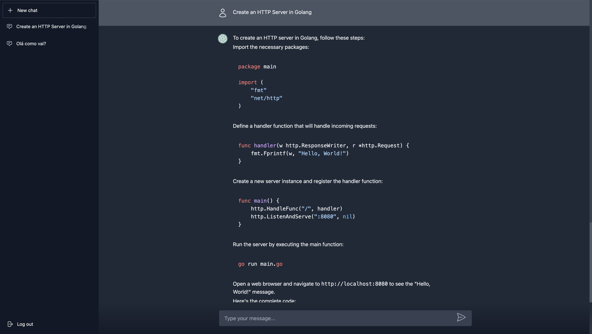

# Chatbot App

<p align="center">
  
</p>

## Overview

This application is a Chatbot that uses the OpenAI API to maintain a conversation, it has an interface similar to ChatGPT itself.

https://user-images.githubusercontent.com/22561893/234720669-2c48c8d2-aa28-45a7-9eb5-10d1fbf66a91.mov

### Project Architecture Overview


### Project Architecture (Next.js Deeper Look)


### gRPC and Streams


Chat Front-end

- [x] Next.js
- [x] BFF (Route Handlers)
- [x] SES
- [x] gRPC Client
- [x] MySQL
- [x] Prisma
- [x] SWR
- [x] Next Auth
- [x] Keycloak
- [x] Tailwindcss
- [x] Docker + Docker Compose

Chat Microservice

- [x] Golang
- [x] MySQL
- [x] SQLC
- [x] Go Chi
- [x] Go OpenAI
- [x] gRPC Server Stream
- [x] REST API
- [x] Docker + Docker Compose

---

## Setup app

### Chat Microservice

Access the folder:

```sh
$ cd chat-service
```

Create `.env` file:

```sh
$ cp .env.example .env
```

> Update the variable values as needed.

[Create OpenAI Secret Key](https://platform.openai.com/docs/quickstart/add-your-api-key) and update the variable below:

```sh
OPENAI_API_KEY="PASTE THE OPENAI SECRET KEY VALUE"
```

### Chat Front-end

Access the folder:

```sh
$ cd chat
```

Create `.env` file:

```sh
$ cp .env.example .env
```

> Update the variable values as needed.

Configure `/etc/hosts`:

```sh
# Mac and Linux
# /etc/hosts

# Windows
# C:\Windows\System32\drivers\etc\hosts

127.0.0.1 host.docker.internal
```

Keycloak settings

Access Keycloak Administration Console

> **Username**: admin

> **Password**: admin

```txt
http://host.docker.internal:9000
```

Create Realm:

> **Realm name**: chat-app

> **Enabled**: yes


Create User:

> This user will be used for you to access app, so define as you wish the name, email, etc.

> After create user, go to `Credentials` tab and set a new password, unchecked temporary option.


Create Client:

> **ClientID**: nextjs

> **Valid redirect URIs**: http://localhost:3000/*

> **Web origins**: http://localhost:3000/*

> **Client authentication**: On

> **Authentication flow**: Standard flow and Direct access grants


After create client, go to `Credentials` tab and copy `Client secret` value and add in the `.env` file:

```sh
KEYCLOAK_CLIENT_SECRET="PASTE THE CLIENT SECRET VALUE"
```

<br />

## Run app

### Chat Microservice

Up Container:

```sh
$ docker-compose up -d
```

Access container:

```sh
$ docker exec -it chatservice_app /bin/bash
```

Install dependencies:

```sh
$ go mod tidy
```

Run migrations:

```sh
$ make migrate
```

Run microservice:

```sh
$ go run cmd/chatservice/main.go
```

### Chat Front-end:

Up Container:

```sh
$ docker-compose up -d
```

Access container:

```sh
$ docker exec -it chat_app /bin/bash
```

Install dependencies:

```sh
$ npm install
```

Run migrations:

```sh
$ npx prisma migrate dev
```

Run front-end:

```sh
$ npm run dev
```
